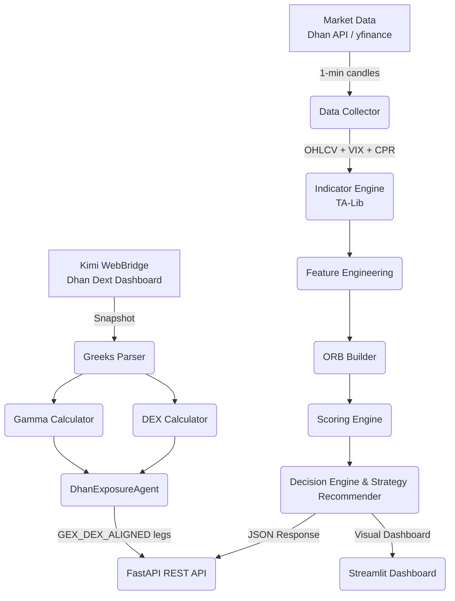

# ORB Strength Score Engine (OSSE)

[](https://www.python.org/)
[](https://fastapi.tiangolo.com/)
[](https://streamlit.io/)
[](LICENSE)

A quantitative decision engine and statistical confidence filter built for **Opening Range Breakout (ORB)** setups on Indian equity markets (**NIFTY 50**, **BANK NIFTY**, **SENSEX**, **FINNIFTY**, and top NSE equities).

The OSSE engine evaluates intraday 1-minute market structure against statistical indicators, higher timeframe daily trends, Central Pivot Range (CPR), and **Implied Volatility (IV) Rank**, outputting a score (0–100) and actionable **Strategy Recommendations** tailored for **Option Selling** and **Swing Trading**.

---

## 🌟 Key Features

1. **ORB Strength Score Engine (0–100)**:
   - Dynamic multi-factor scoring across Relative Volume, ADX Trend Strength, ATR Expansion, VWAP Distance, EMA Alignment, Gap %, and Candle Efficiency.
2. **Option Selling Analytics (India VIX, IV Rank & Percentile)**:
   - Integrates 1-year India VIX (`^INDIAVIX`) history to calculate 52-week **IV Rank** ($0–100\%$) and **IV Percentile** ($0–100\%$) to identify high-premium option selling opportunities.
3. **Strategy Recommendation Engine**:
   - Maps score, IV Rank, and regime into explicit trade strategies:
     - **High Score + High IV**: *Directional Credit Spread (Sell Put / Sell Call)*
     - **High Score + Low IV**: *Directional Breakout Swing (Long Futures / Debit Spread)*
     - **Moderate Score + High IV**: *Iron Condor / Short Strangle*
     - **Low Score + High IV**: *Non-Directional Short Straddle / Iron Fly*
     - **Low Score + High Risk Chop**: *No Trade / Avoid*
4. **Higher Timeframe & Central Pivot Range (CPR)**:
   - Calculates daily Pivot ($P$), Top Central ($TC$), Bottom Central ($BC$), and CPR Width %.
   - Verifies 15-minute intraday trend alignment with the Daily 20 EMA trend.
5. **Zero-Scroll Single-Screen Dashboard**:
   - High-density 2-column Streamlit UI with an animated circular 60s SVG countdown timer, live 1-minute auto-scanning, and side-by-side Pros ✅ & Cons ❌ trade reasoning cards.
6. **Dhan Dext Exposure-Driven Strike Selection**:
   - Uses **Kimi WebBridge** to read the live Dhan Dext dashboard, extracts **Delta Exposure (DEX)** and **Gamma Exposure (GEX)**, and drives the `GEX_DEX_ALIGNED` strike-selection variant.
   - Falls back to the existing `DhanMCPCollector` if the WebBridge daemon is not running.
7. **Multi-Day Swing Backtest & Metrics**:
   - Measures **Win Rate %**, **Avg MFE (Maximum Favorable Excursion)**, **Avg MAE (Maximum Adverse Excursion)**, and **MFE/MAE Ratio**.

---

## 🛠️ Architecture



---

## 🚀 Quickstart Guide

### 1. Prerequisites
- Python 3.11+
- Virtual Environment (`venv`)

### 2. Installation
Clone the repository and install required dependencies:
```bash
git clone https://github.com/your-username/orb-nifty.git
cd orb-nifty

# Create and activate virtual environment
python -m venv venv
# On Windows:
.\venv\Scripts\activate
# On Linux/macOS:
source venv/bin/activate

# Install dependencies
pip install -r requirements.txt
```

### 3. Environment Configuration
Copy `.env.example` to `.env`:
```bash
cp .env.example .env
```
*(Optional: Populate `dhan_client_id` and `dhan_access_token` in `.env` if using DhanHQ API. If left empty, the engine automatically falls back to `yfinance`.)*

---

## 🖥️ Running the Application

### 1. Streamlit Dashboard
Launch the interactive Streamlit dashboard:
```bash
python run_dashboard.py
```
Open your browser at **http://localhost:8501** (or **http://localhost:8502**).

### 2. FastAPI REST API
Launch the FastAPI server:
```bash
python -m uvicorn osse.api.app:app --host 0.0.0.0 --port 8000
```
- API Endpoint: `POST http://localhost:8000/api/v1/score`
- API Endpoint: `POST http://localhost:8000/api/v1/exposure-strikes`
- Interactive API Docs: **http://localhost:8000/docs**

### 3. Dhan Exposure Agent CLI
Fetch live Delta/Gamma exposure from Dhan Dext and generate GEX/DEX-aligned strikes from the command line.

**Prerequisite:** Kimi WebBridge must be running:
```bash
kimi-webbridge start
```

**Run the agent:**
```bash
python scripts/run_exposure_agent.py \
  --url "https://dext.dhan.co/dashboard" \
  --symbol NIFTY \
  --direction UP \
  --strategy "Directional Credit Spread" \
  --variant GEX_DEX_ALIGNED \
  --expiry WEEKLY
```

**Common options:**
| Option | Default | Description |
|---|---|---|
| `--url` | `https://dext.dhan.co/dashboard` | Dhan Dext URL to navigate to |
| `--symbol` | `NIFTY` | Underlying symbol (`NIFTY`, `BANKNIFTY`, `FINNIFTY`, `SENSEX`) |
| `--direction` | `UP` | Trade direction: `UP` (bullish / put credit spread) or `DOWN` (bearish / call credit spread) |
| `--strategy` | `Directional Credit Spread` | Strategy name passed to the strike selector |
| `--variant` | `GEX_DEX_ALIGNED` | Strike selection variant |
| `--expiry` | `WEEKLY` | Expiry type: `WEEKLY`, `NEXT_WEEKLY`, `MONTHLY` |
| `--daemon-url` | `http://127.0.0.1:10086` | Kimi WebBridge daemon URL |
| `--no-mcp-fallback` | — | Disable `DhanMCPCollector` fallback if WebBridge is unreachable |
| `--output` | — | Optional JSON file to write the result to |

**Example response (excerpt):**
```json
{
  "status": "SUCCESS",
  "collector_used": "webbridge",
  "symbol": "NIFTY",
  "spot_price": 24317.15,
  "delta_exposure": { "total_call": 3443508.36, "total_put": -2814502.27, "ratio": 0.82, ... },
  "gamma_exposure": { "total_call": 3068860.42, "total_put": -2269369.73, "ratio": 0.74, ... },
  "strike_recommendation": {
    "variant_used": "GEX_DEX_ALIGNED",
    "legs": [
      { "action": "SELL", "option_type": "PE", "strike": 24450.0, ... },
      { "action": "BUY",  "option_type": "PE", "strike": 24350.0, ... }
    ],
    ...
  }
}
```

### 4. Exposure Strikes API Endpoint
```bash
curl -X POST http://localhost:8000/api/v1/exposure-strikes \
  -H "Content-Type: application/json" \
  -d '{
    "url": "https://dext.dhan.co/dashboard",
    "symbol": "NIFTY",
    "direction": "UP",
    "strategy_name": "Directional Credit Spread",
    "variant": "GEX_DEX_ALIGNED",
    "expiry_type": "WEEKLY"
  }'
```

---

## 🧪 Running Tests

Run the unit test suite using `pytest`:
```bash
python -m pytest
```

If imports resolve from the `src/` layout, run with `PYTHONPATH=src`:
```bash
PYTHONPATH=src python -m pytest tests/ -q
```

---

## 📄 License

This project is licensed under the MIT License - see the LICENSE file for details.
