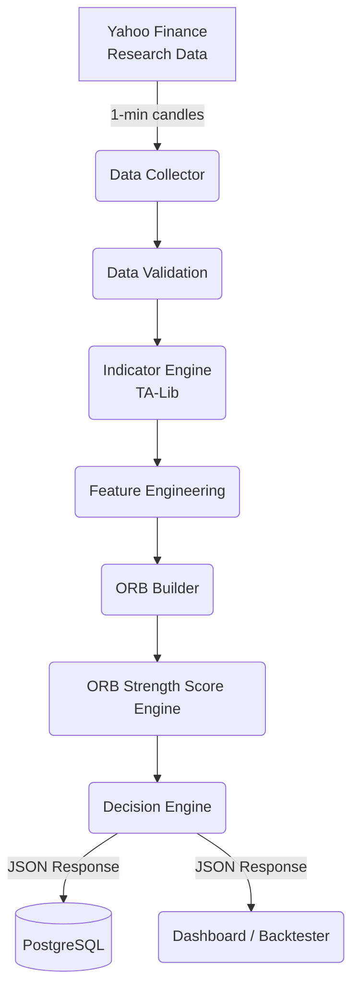

# ORB Strength Score Engine (OSSE) Architecture

## Overview
The OSSE is a Python-based quantitative decision engine that computes an Opening Range Breakout (ORB) Strength Score (0–100) for NIFTY, BANKNIFTY, and SENSEX. The engine acts as a statistical filter that sits between raw market data and trade execution, aiming to improve risk-adjusted returns and reduce false breakouts in options-selling strategies.

## System Architecture Diagram



## Module Definitions

### 1. Data Collector (`src/osse/data/collector.py`)
Responsible for pulling 1-minute historical and intraday data using `yfinance`.
*   **Inputs:** Ticker symbol, Start Date, End Date, Interval (1m).
*   **Output:** `pandas.DataFrame` of OHLCV data.

### 2. Data Validation (`src/osse/data/validator.py`)
Ensures the raw data is complete. Handles missing bars and validates that the required trading session (09:15 - 15:30) is present.

### 3. Indicator Engine (`src/osse/features/indicators.py`)
Uses `TA-Lib` to compute all required technical indicators:
*   EMA (20, 50, 200)
*   ATR (Daily and Intraday)
*   VWAP
*   RSI
*   ADX
*   Bollinger Bands

### 4. ORB Builder (`src/osse/features/orb_builder.py`)
Isolates the 09:15–09:30 AM window and calculates:
*   ORB High & Low
*   ORB Width
*   Candle Efficiency

### 5. Feature Engineering (`src/osse/features/engineering.py`)
Generates descriptive and rolling statistics (e.g., Rolling Volume, Rolling VWAP Distance, Rolling ADX) and prepares the dataset for normalization.

### 6. Scoring Engine (`src/osse/engine/normalizer.py`, `src/osse/engine/scorer.py`)
*   **Normalizer:** Transforms features into a common scale using Min-Max Scaling, Z-score, or Percentile Rank as defined in the configuration.
*   **Scorer:** Applies the weighted sum formula using the dynamically loaded `config/scoring_rules.yaml`.

### 7. Decision Engine (`src/osse/engine/decision.py`)
Translates the numerical score (0-100) into a discrete trade action:
*   `≥75`: Exceptional (TRADE)
*   `65–74`: High Confidence (TRADE)
*   `55–64`: Tradable (REDUCED SIZE)
*   `45–54`: Weak (NO TRADE)
*   `<45`: Reject (NO TRADE)

### 8. API Contract (`src/osse/api/app.py`)
A `FastAPI` application exposing an endpoint to trigger the score generation.
*   **Endpoint:** `POST /api/v1/score`
*   **Response Format:**
```json
{
  "score": 84.6,
  "confidence": "High",
  "decision": "TRADE",
  "regime": "TREND"
}
```

